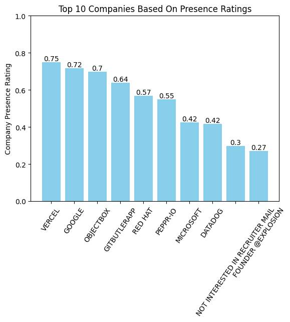
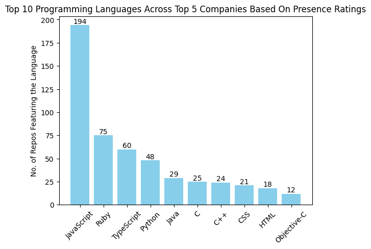

# Sailent Points  :
* **Scraping Process** : Scraping done primarily using Github REST API resources online discourse and ChatGPT assistance. After scraping, data was cleaned to create users.csv and repositories.csv
* **Interesting Observations**: Self-defined a **Company Presence-Rating(look at analyisis.ipynb)** to find Top 10 companies based on presence. Interestingly,I found that **VERCEL** has the highest presence with Google at 2nd. Microsoft is at 7th. Also,people who are not interested in recruiter mails(indicating stable developers) also have a healthy presence at 9th spot.
* **Recommendation to Developers** : **JavaScript** is by far the most popular language among users of the Top 5 companies in Berlin. So, to increase the number of followers developers can focus on JavaScript related projects on Github.

# Important Note :
Analysis has been done based on a *self-defined* **Company Presence Rating**. Look at **analysis.ipynb** for more details.

# Results :
(Based on **Company Presence Rating** for Berlin users with greater than 200 followers)

