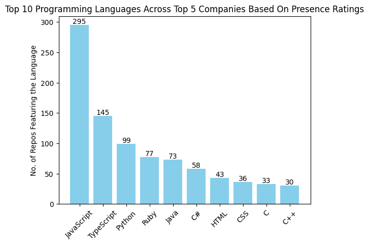

# Sailent Points  :
* **Scraping Process** : First scraped the data primarily using Github REST API and ChatGPT assistance and created users0.csv and repositories0.csv files. The scrape code **adheres to API rate limits**. Then cleaned the data to create users.csv and repositories.csv files for further analyis. (Note: The analysis has been done in **analysis.ipynb** file and scraping and questions solved in **scrape.ipynb** file for convienience.)
* **Interesting Observations**: Self-defined a **Company Presence-Rating(look at analyisis.ipynb)** to find Top 10 companies based on presence. Interestingly, I found that **VERCEL** has the highest presence. Also, people who are not interested in recruiter mail(indicating stable developers) have a healthy presence at the 9th spot.
* **Recommendation to Developers** : **JavaScript** and its variant **TypeScript** are by far the most popular language among users of the Top 5 companies in Berlin. So, to increase the number of followers developers can focus on projects related to these languages on Github.

# Important Note :
Analysis has been done based on a *self-defined* **Company Presence Rating**. Please take a look at **analysis.ipynb** for more details.  
  
For scraping and questions code look at **scrape.ipynb**

# Results :
(Based on self-defined **Company Presence Rating** for Berlin users with greater than 200 followers)

# Contact :
*21f1006954@ds.study.iitm.ac.in*

