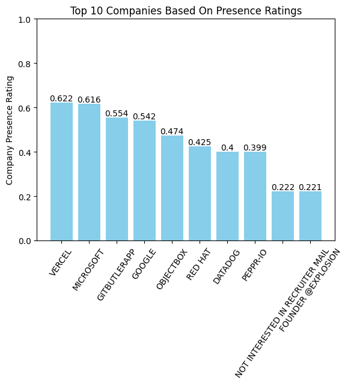

# Sailent Points  :
1. **Self-Defined Rating metric** : I self-defined a **Company Presence-Rating(look at analyisis.ipynb for more details)** to find Top 10 companies based on presence. The metric gives equal weights to 3 parameters : *'total_followers', 'total_stargazers_count' and 'total_public_repos'* to judge a company's presence on the Github platform. The metric ranges 0.0 to 1.0.
2. **Scraping Process** : First scraped the data primarily using Github REST API and ChatGPT assistance and created users0.csv and repositories0.csv files. Then cleaned the data to create users.csv and repositories.csv files for further analyis. (Note 1: The analysis has been done in **analysis.ipynb** file and scraping and questions solved in **scrape.ipynb** file for convienience.)  (Note 2:The scrape code **adheres to API rate limits**.)
3. **Interesting Findings**: Based on the **Company Presence-Rating**, interestingly I found that **VERCEL** has the highest presence. Also, people who are not interested in recruiter mail(indicating stable developers) take the 9th spot with healthy presence.
4. **Recommendation to Developers** : **JavaScript** and its variant **TypeScript** are by far the most popular language among users of the Top 5 companies in Berlin. So, to increase the number of followers developers can focus on projects related to these languages on Github.

# Important Note :
Analysis has been done based on a *self-defined* **Company Presence Rating**. Please take a look at **analysis.ipynb** for more details.  
  
For scraping and questions code look at **scrape.ipynb**

# Results :
(Based on self-defined **Company Presence Rating** for Berlin users with greater than 200 followers)

# Contact :
*21f1006954@ds.study.iitm.ac.in*

